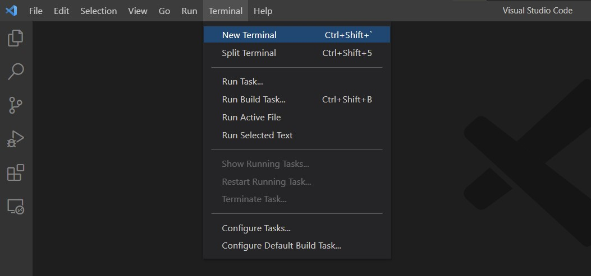
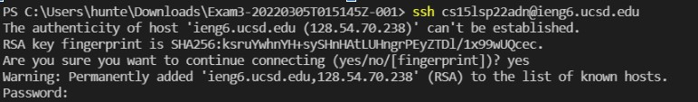
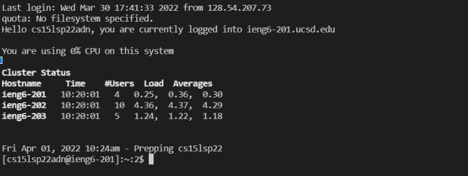
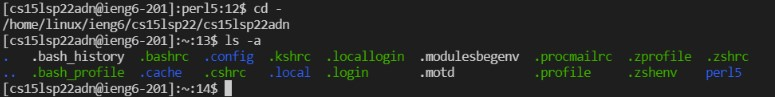
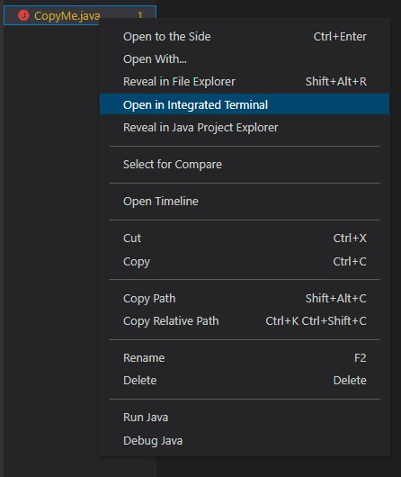
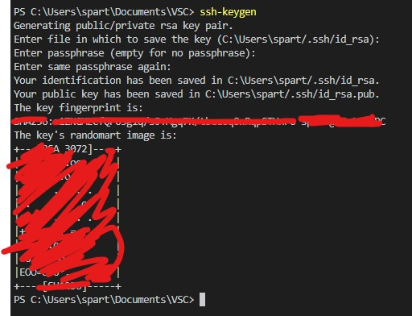
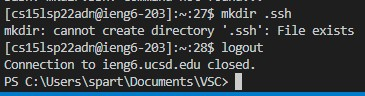
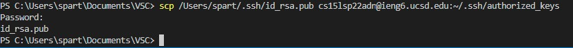
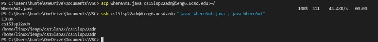

# Remote Access Tutorial

Welcome CSE15L students!

So you want to remotely log in to your course-specific account on ieng6?

Follow these steps:

1. ## Install Visual Studio Code
    - Download [HERE](https://code.visualstudio.com/download)
    - Open the downloaded file and just keep clicking next until you reach the end!
    

2. ## Remote Connecting
    - Open a new terminal
    
    - If you don't already know your username and password for your course-specific account you can find it [HERE](https://sdacs.ucsd.edu/~icc/index.php)
    - Now, with your terminal, you need to put this command in: ```ssh cs15lsp22zz@ieng6.ucsd.edu , with the email being your username you found in the step above
    
    
    - It will then prompt you for your password, while you type it  in, it will not appear for security reasons. Press enter when done to log in.
    
    - You are now logged in!
    
3. ## Trying Some Commands
    - There are a bunch of commands to now try! 
        - ```ls ```
        - ```ls -a ```
        - ```cd ~```
        - ```cd```
        - ```lat```
    - Try them out and see what they do:
    

4. ## Moving Files With SCP
    - Here we are gonna attempt to transfer files from your local computer to the remote server.
    - In visual studio code, create a file named: ```CopyMe.java```
    - In the file, put the following lines of code
    ```
    class CopyMe {
        public static void main(String[] args) {
            System.out.println("Hello World!");
        }
    }
    ```
    - Save it then open a new terminal in the directory you made this file.
    
    - Now in your terminal, input the command: 
    ```scp CopyMe.java cs15lsp22zz@ieng6.ucsd.edu:~/``` (again replacing the email with your username)

    - It will ask for your password, just type it in the same way you would log in.
    - Now the file will be in the server! Log in once more with ssh, and type the command ls, you should be able to see your file now!

5. ## Setup an SSH Key
    - This will allow you to log in without a password!
    - On your local computer, type this commands in:
        - ```ssh-keygen```
    - then press enter until you see this in your terminal (marked out in red for privacy):
    
    - This has created keys from your computer both public and private. We now want to transfer the **public** keys over to the server. 
    - Now log into the server:
        - ```ssh cs15lsp22zz@ieng6.ucsd.edu```
        - once logged in type in the following:
        - ```mkdir .ssh```
        - then logout

        
    - Finally enter one last command on your local pc:
        - ```scp /Users/user-name/.ssh/id_rsa.pub cs15lsp22zz@ieng6.ucsd.edu:~/.ssh/authorized_keys```
        - make sure to replace the usernames!
        
    - Now you can login without a password!

6.  ## Optimizing Remote Running
    - Tips and Tricks:
        - Remember to use the up arrow on your keyboard to bring up the last command without having to type it in manually!
        - We can run commands in the same command line as logging in which streamlines the process. For example:
        
        - Here I used uparrow to retrieve a previous command, then the second line I put in quotations the java commands I want to run. This allows the java file to compile and run all in 1 line!
        - Try it with the file you copied over!
            - ```ssh cs15lsp22zz@ieng6.ucsd.edu "javac CopyMe.java; java CopyMe"```


