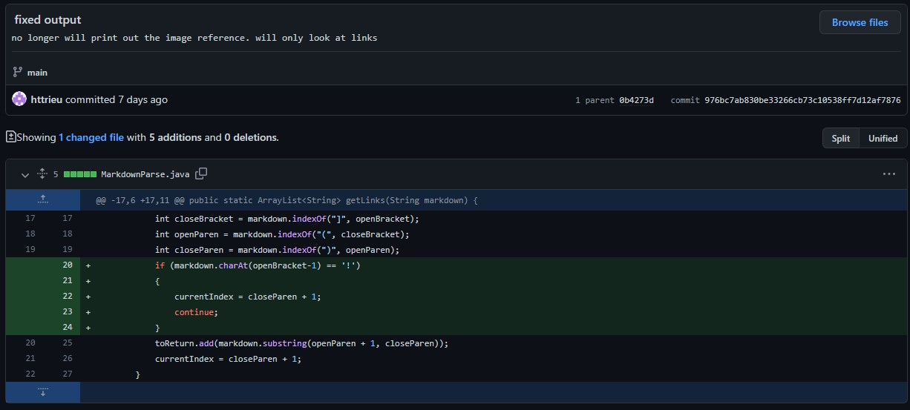

# Debugging

## 1. Bug 1: Having an image in the markdown file

### Code Change

- [The failure-inducing input file](https://github.com/httrieu/markdown-parser/blob/main/test-file2.md)
- Wrong output:
    `[https://www.microsoft.com/en-us/store/apps/windows, test.jpg]`
-  The bug was the result of the program not accounting for an image accidentally being placed in the markdown file. The prgoram could not tell the difference between a link and an image. This led to the symptom that the program would then output the both the links and the image file the same, instead of ignoring the image file because it was not a link. 

## 2. Bug 2: 

## 3. Bug 3