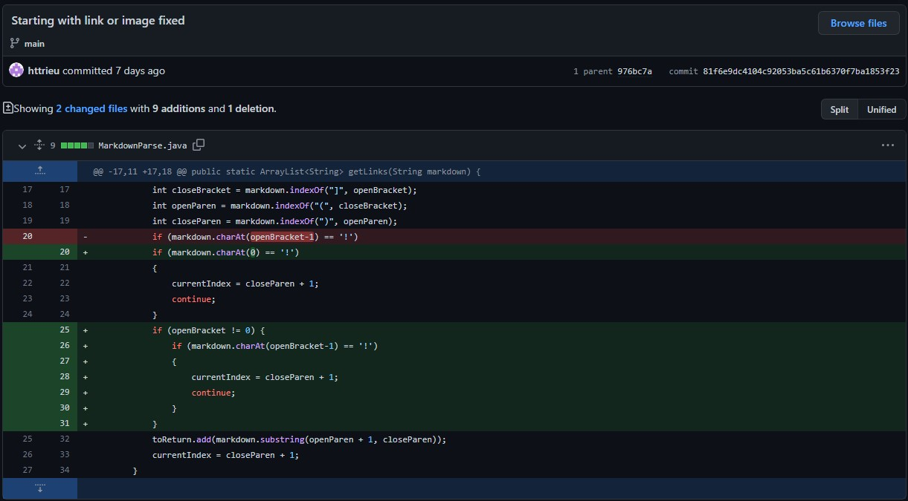
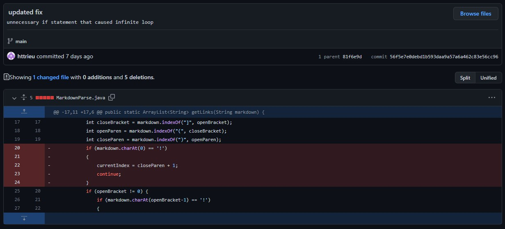
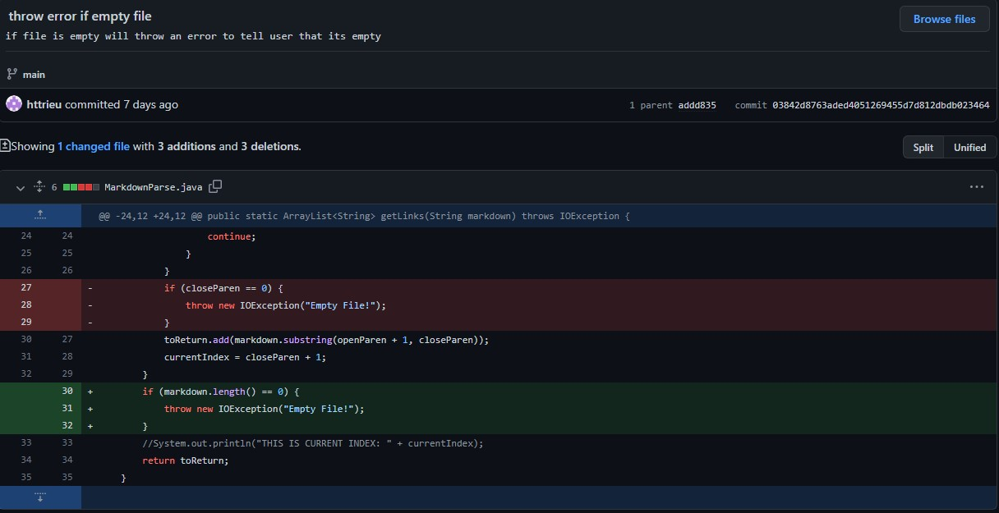

# Debugging

## 1. Bug 1: Having an image in the markdown file
### Code Change 1

- [The failure-inducing input file](https://github.com/httrieu/markdown-parser/blob/main/test-file2.md)
- Wrong output:
```
[https://www.microsoft.com/en-us/store/apps/windows, test.jpg]
```
-  The bug was the result of the program not accounting for an image accidentally being placed in the markdown file. The prgoram could not tell the difference between a link and an image. This led to the symptom that the program would then output the both the links and the image file the same, instead of ignoring the image file because it was not a link. 

## 2. Bug 2: Having a markdown file begin with a link or image
### Code Change 1

### Code Change 2

- [The failure-inducing input file](https://github.com/httrieu/markdown-parser/blob/main/test-file3.md)
- Errror output: 
```
Exception in thread "main" java.lang.StringIndexOutOfBoundsException: String index out of range: -1
        at java.base/java.lang.StringLatin1.charAt(StringLatin1.java:48)
        at java.base/java.lang.String.charAt(String.java:1512)
        at MarkdownParse.getLinks(MarkdownParse.java:20)
        at MarkdownParse.main(MarkdownParse.java:57)
```
- The bug was a result of the previous fix, where it would check the index out of bounds. The input markdown file starts with a image or link, and because of this it would check index -1 for an exclamation mark, which is out of bounds. The symptom would be the error output we have. 

## 3. Bug 3: Empty markdown file (no links)
### Code Change 1

### Code Change 2

- [The failure-inducing input file](https://github.com/httrieu/markdown-parser/blob/main/test-file4.md)
- Wrong output:
```
[]
```
- With an empty file as the input, the arraylist would then be empty and this was a bug. With an empty arraylist the symptom would just be the program printing out a empty arraylist when it should throw an exception to tell the user that it's an invalid input.
