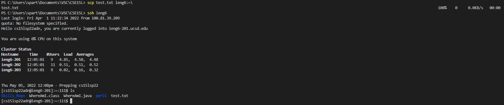
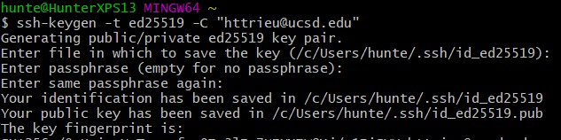
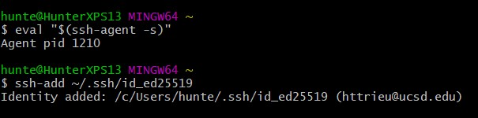
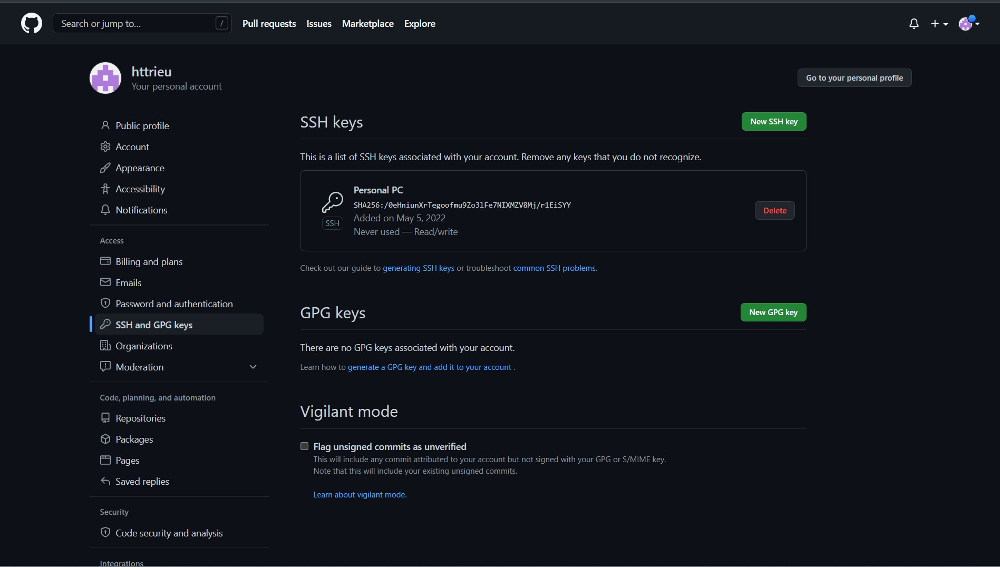
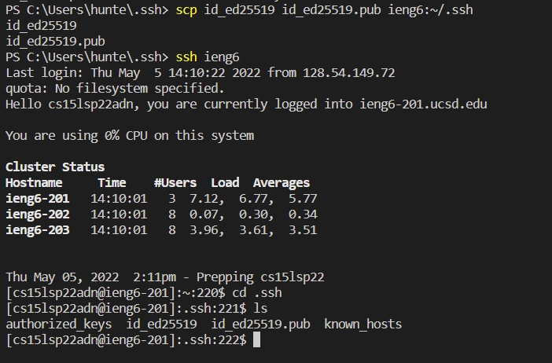
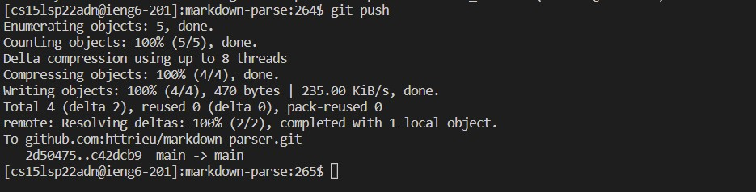
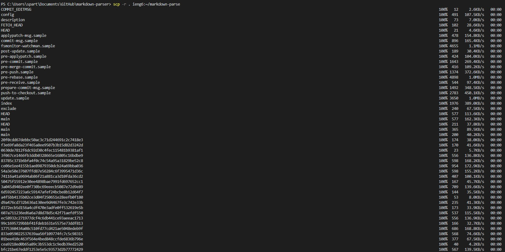
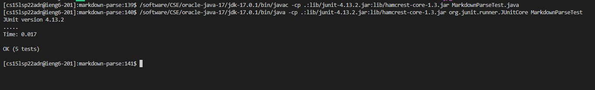
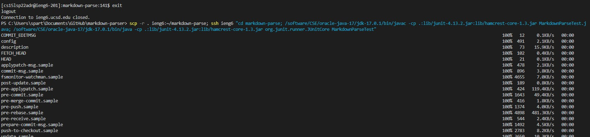
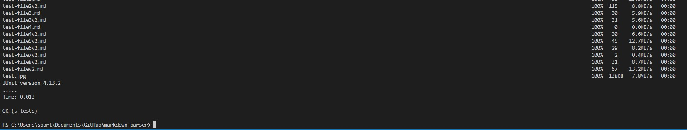

# Lab Report 3

## Streamlining ssh Configuration

### 1. ssh/config file edit

### 2. ssh command

### 3. scp command

## Setup Github Access from ieng6

### 1. Created Keys for Github

### 2. Added Key to SSH-Agent

### 3. Added Public Key to GitHub

### 4. Private Key on ieng6 Account

### 5. Testing it out

### 6. Testing the Push command

## Copy whole directories with scp -r

### 1. Copying MarkdownParse directory into SSH

### 2. Running Tests off ieng6

### 3. Copying Directory and Running Tests in 1 Line

