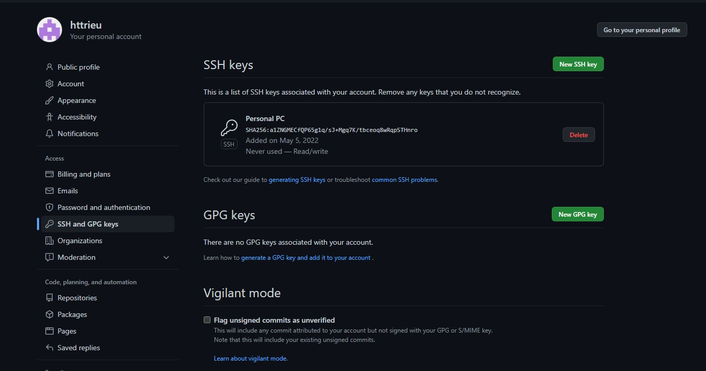
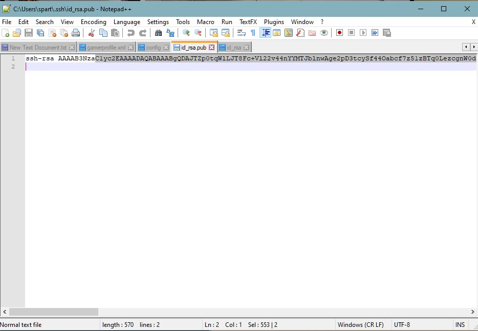
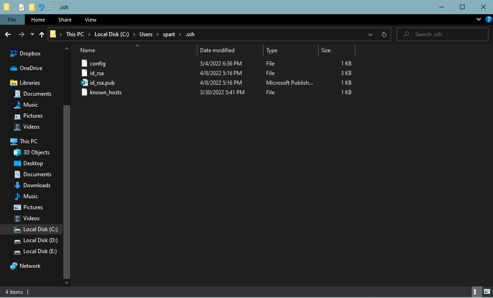

# Lab Report 3

## Streamlining ssh Configuration

### 1. ssh/config file edit

### 2. ssh command

### 3. scp command

## Setup Github Access from ieng6

### 1. Public key in github

### 2. Public key in my account

### 3. Private key in my account

### Git Commands

### Link to the

## Copy whole directories with scp -r

### 1. Copying MarkdownParse directory into SSH

### 2. Running Tests off ieng6

### 3. Copying Directory and Running Tests in 1 Line

