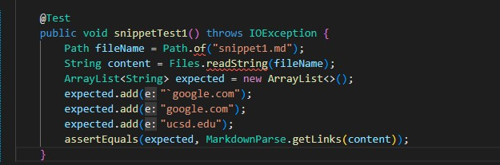
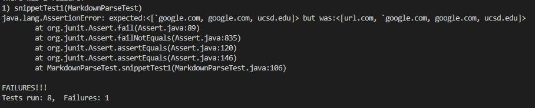
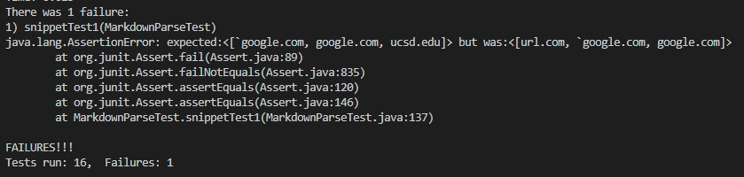

# Lab Report 4

1. My markdown-parser: [here](https://github.com/httrieu/markdown-parser)
2. The markdown-parser we reviewed: [here](https://github.com/aaronchan32/markdown-parser)

## Test Snippet 1

### Test Case in MarkdownParseTest.java

### 1. My implementation

Failed test:

### 2. Their implementation

Failed test:

