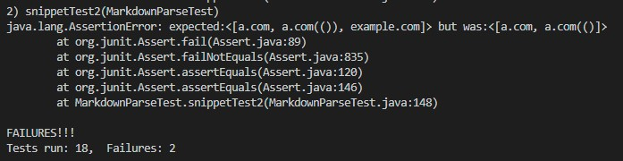

# Lab Report 4

1. My markdown-parser: [here](https://github.com/httrieu/markdown-parser)
2. The markdown-parser we reviewed: [here](https://github.com/aaronchan32/markdown-parser)

## Test Snippet 1

### Test Case in MarkdownParseTest.java

These were decided to be valid links because in the preview it was able to be hyperlinked.

### 1. My implementation

Failed test:

### 2. Their implementation

Failed test:

I think there might be a small code change/addition that would make the program work with inline backticks. Because markdown sees these backticks as quotations, adding an if statement where a link starts with a backtick should not be added to the list because it wouldn't be valid.

## Test Snippet 2

### Test Case in MarkdownParse.java

### 1. My implementation

### 2. Their implementation

This would be a signifcantly harder change to implement. My group tried to fix the problem with multiple open and closed parenthesises but we were unable to. It would somehow require identifying that multiple parenthesises are not the end of the link, which creates a problem with how to identify when a link is complete or not.

## Test Snippet 3

### Test Case in MarkdownParse.java

### 1. My implementation

### 2. Their implementation

This one seems by far the most complicated to fix as both implemenatations were nowhere near to getting it correct. There are multiple line breaks and incorrect formatting except for 1 link which has parenthesis on different lines. Currently my code throws an error because it was designed to not take any invalid files, but even the program we reviewed couldn't even access the file because it immediately threw an out of bounds error.