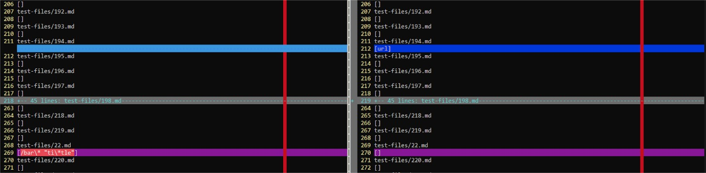

# Lab Report 5

## Test 1 

Test 1 [here](https://github.com/nidhidhamnani/markdown-parser/blob/main/test-files/22.md)

1. To find this test we used vimdiff on the results of both the given implementation and our implmementation. We just scrolled until we found the differences manually. 

2. Both implementations are incorrect (in the above screenshots, on line 269 for our implementation and line 270 for the given implemenetation). The correct output should look like this: [ti\*tle], because markdown shows this: [foo](/bar\* "ti\*tle"). 

## Test 2

Test 2 [here](https://github.com/nidhidhamnani/markdown-parser/blob/main/test-files/194.md)

