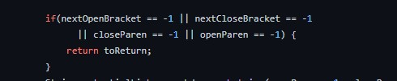
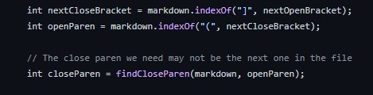

# Lab Report 5

## Test 1 

Test 1 [here](https://github.com/nidhidhamnani/markdown-parser/blob/main/test-files/22.md)

1. To find this test we used vimdiff on the results of both the given implementation and our implmementation. We just scrolled until we found the differences manually. 

2. Both implementations are incorrect (in the above screenshots, on line 269 for our implementation and line 270 for the given implemenetation). The correct output should look like this: `[ti\*tle]`, because markdown shows this: `[foo](/bar\* "ti\*tle")`. 

3. The problem, is more general than just this screenshot. What happens is that the program does not account for backslashes, and thus this entire line gets ignored completely. So it then looks for the next link, but there is no link so it returns an empty arraylist when really there is still a 'valid' link.

## Test 2

Test 2 [here](https://github.com/nidhidhamnani/markdown-parser/blob/main/test-files/194.md)

1. This test is also included in the above screenshot, as we just scrolled down and found it using vimdiff. 

2. Both implementations are again incorrect, our code ran into an infinite loop so we had to completely skip over the file. The program provided outputted a link, but not what was supposed to show up. It outputted: `[url]`. What should have been outputted was: `[title (with parens)]`. 

3. The problem that occurs I think is that because the original md file is:
`[Foo*bar\]]:my_(url) 'title (with parens)'`, the lines above only look at the first closed parenthesis. It disregards the fact that the markdown file might actually have the link later in the file with parenthesis. I am unsure how you would account for such a messed up line of md.
